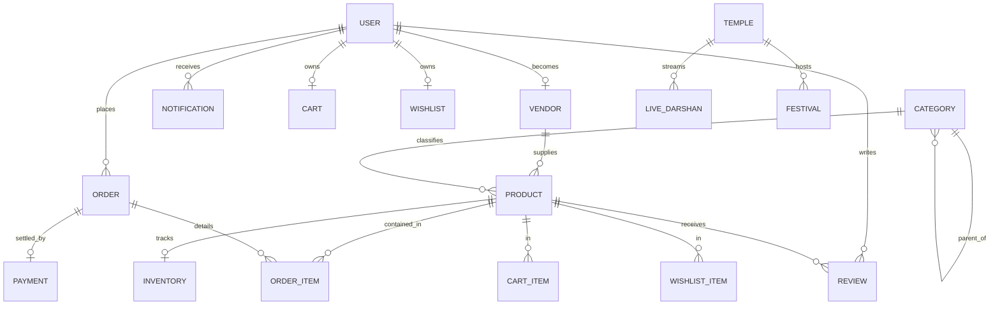

# Database Architecture Design - Ramanayam Backend

This document outlines the planned relational database design, schema layout, auditing, and connection strategies for the **Ramanayam** platform. It provides a blueprint for developers before actual code generation and migrations are written.

---

## 1. System Entities & High-Level Domain Model

The database is structured to support multi-vendor e-commerce, temple management, live darshan streaming scheduler, festivals, and analytics reporting.

### Core Modules and Table Relations

---

## 2. Relational Schema Blueprint (Logical Model)

The database columns, relationships, and data types are planned as follows:

### 2.1 Core Identity & User Management
* **`users`**
  * `id`: `UUID` (Primary Key)
  * `email`: `VARCHAR(255)` (Unique, Indexed)
  * `password_hash`: `VARCHAR(255)`
  * `first_name`: `VARCHAR(100)`
  * `last_name`: `VARCHAR(100)`
  * `role`: `ENUM('USER', 'VENDOR', 'ADMIN', 'SUPERADMIN')`
  * `is_verified`: `BOOLEAN` (Default: `false`)
  * `created_at`: `TIMESTAMP` (Default: `NOW()`)
  * `updated_at`: `TIMESTAMP`

* **`vendors`**
  * `id`: `UUID` (Primary Key)
  * `user_id`: `UUID` (Unique, Foreign Key referencing `users.id`)
  * `store_name`: `VARCHAR(150)` (Unique)
  * `description`: `TEXT`
  * `support_email`: `VARCHAR(255)`
  * `phone_number`: `VARCHAR(20)`
  * `is_approved`: `BOOLEAN` (Default: `false`, Managed by Admin)
  * `status`: `ENUM('ACTIVE', 'SUSPENDED', 'PENDING')`

---

### 2.2 Catalog & Inventory Management
* **`categories`**
  * `id`: `UUID` (Primary Key)
  * `name`: `VARCHAR(100)`
  * `slug`: `VARCHAR(150)` (Unique, Indexed)
  * `description`: `TEXT`
  * `parent_id`: `UUID` (Self-referencing Foreign Key, nullable for root categories)

* **`products`**
  * `id`: `UUID` (Primary Key)
  * `vendor_id`: `UUID` (Foreign Key referencing `vendors.id`)
  * `category_id`: `UUID` (Foreign Key referencing `categories.id`)
  * `name`: `VARCHAR(200)` (Indexed)
  * `slug`: `VARCHAR(255)` (Unique, Indexed)
  * `description`: `TEXT`
  * `price`: `DECIMAL(12, 2)`
  * `compare_at_price`: `DECIMAL(12, 2)` (For discounts)
  * `sku`: `VARCHAR(100)` (Unique, Indexed)
  * `images`: `JSONB` (Array of image URLs and metadata)
  * `status`: `ENUM('DRAFT', 'PUBLISHED', 'OUT_OF_STOCK', 'ARCHIVED')`

* **`inventory`**
  * `id`: `UUID` (Primary Key)
  * `product_id`: `UUID` (Unique, Foreign Key referencing `products.id`)
  * `quantity`: `INTEGER` (Default: `0`)
  * `low_stock_threshold`: `INTEGER` (Default: `5`)
  * `location`: `VARCHAR(100)` (Warehouse reference)

---

### 2.3 Cart & Wishlist
* **`carts`**
  * `id`: `UUID` (Primary Key)
  * `user_id`: `UUID` (Unique, Foreign Key referencing `users.id`)

* **`cart_items`**
  * `id`: `UUID` (Primary Key)
  * `cart_id`: `UUID` (Foreign Key referencing `carts.id`, Cascade Delete)
  * `product_id`: `UUID` (Foreign Key referencing `products.id`)
  * `quantity`: `INTEGER`

* **`wishlists`**
  * `id`: `UUID` (Primary Key)
  * `user_id`: `UUID` (Unique, Foreign Key referencing `users.id`)

* **`wishlist_items`**
  * `id`: `UUID` (Primary Key)
  * `wishlist_id`: `UUID` (Foreign Key referencing `wishlists.id`, Cascade Delete)
  * `product_id`: `UUID` (Foreign Key referencing `products.id`)

---

### 2.4 Sales, Orders & Payments
* **`orders`**
  * `id`: `UUID` (Primary Key)
  * `user_id`: `UUID` (Foreign Key referencing `users.id`)
  * `order_number`: `VARCHAR(50)` (Unique, Indexed)
  * `status`: `ENUM('PENDING', 'PROCESSING', 'SHIPPED', 'DELIVERED', 'CANCELLED', 'RETURNED')`
  * `total_amount`: `DECIMAL(12, 2)`
  * `shipping_address`: `JSONB`
  * `billing_address`: `JSONB`
  * `created_at`: `TIMESTAMP`

* **`order_items`**
  * `id`: `UUID` (Primary Key)
  * `order_id`: `UUID` (Foreign Key referencing `orders.id`, Cascade Delete)
  * `product_id`: `UUID` (Foreign Key referencing `products.id`)
  * `quantity`: `INTEGER`
  * `unit_price`: `DECIMAL(12, 2)`
  * `total_price`: `DECIMAL(12, 2)`

* **`payments`**
  * `id`: `UUID` (Primary Key)
  * `order_id`: `UUID` (Unique, Foreign Key referencing `orders.id`)
  * `transaction_id`: `VARCHAR(255)` (Unique, e.g., Stripe/Razorpay ref)
  * `provider`: `VARCHAR(50)`
  * `amount`: `DECIMAL(12, 2)`
  * `status`: `ENUM('PENDING', 'COMPLETED', 'FAILED', 'REFUNDED')`
  * `payment_method`: `VARCHAR(50)`
  * `raw_response`: `JSONB`

---

### 2.5 Temple Management, Live Darshan & Festivals
* **`temples`**
  * `id`: `UUID` (Primary Key)
  * `name`: `VARCHAR(200)`
  * `slug`: `VARCHAR(250)` (Unique)
  * `description`: `TEXT`
  * `deity`: `VARCHAR(150)`
  * `location`: `VARCHAR(255)`
  * `timings`: `JSONB` (Opening/Closing schedules)
  * `images`: `JSONB`

* **`live_darshans`**
  * `id`: `UUID` (Primary Key)
  * `temple_id`: `UUID` (Foreign Key referencing `temples.id`)
  * `title`: `VARCHAR(200)`
  * `stream_url`: `VARCHAR(500)`
  * `is_active`: `BOOLEAN` (Default: `false`)
  * `scheduled_start`: `TIMESTAMP`
  * `scheduled_end`: `TIMESTAMP`

* **`festivals`**
  * `id`: `UUID` (Primary Key)
  * `temple_id`: `UUID` (Foreign Key referencing `temples.id`, Nullable if national)
  * `name`: `VARCHAR(200)`
  * `description`: `TEXT`
  * `start_date`: `DATE`
  * `end_date`: `DATE`
  * `rituals`: `JSONB` (List of special Pujas planned)

---

### 2.6 Social, Feedback & Operations
* **`reviews`**
  * `id`: `UUID` (Primary Key)
  * `user_id`: `UUID` (Foreign Key referencing `users.id`)
  * `product_id`: `UUID` (Foreign Key referencing `products.id`)
  * `rating`: `INTEGER` (Check constraint: `1` to `5`)
  * `comment`: `TEXT`
  * `is_approved`: `BOOLEAN` (Default: `false`)

* **`notifications`**
  * `id`: `UUID` (Primary Key)
  * `user_id`: `UUID` (Foreign Key referencing `users.id`)
  * `title`: `VARCHAR(200)`
  * `message`: `TEXT`
  * `type`: `ENUM('ORDER_UPDATE', 'PROMO', 'LIVE_ALERT', 'GENERAL')`
  * `is_read`: `BOOLEAN` (Default: `false`)

---

## 3. Database Indexes Strategy

To keep queries performing under 50ms at scale:
1. **Foreign Key Indexes**: Every FK column will have an index (automatically managed by Prisma or explicitly written as `CREATE INDEX` under Prisma annotations) to optimize join queries.
2. **Text Search Indexes**: Use PostgreSQL `pg_trgm` GIN indexes on `products.name` and `products.description` to allow fast fuzzy search matches.
3. **Compound Indexes**:
   - `reviews(product_id, is_approved)`: Speeds up loading approved comments on product pages.
   - `live_darshans(temple_id, is_active)`: Speeds up finding active feeds.

---

## 4. Connection Management & Security

- **Connection Pool**: Recommended sizing formula:
  $$Connections = (CoreCount \times 2) + EffectiveSpindleCount$$
  Using `PgBouncer` in transaction mode is recommended for serverless/highly scalable environments.
- **Row Level Security (RLS)**: Can be activated directly on PostgreSQL if vendors require strict data isolation (tenancy rules).
- **Audit Logs**: A generic trigger will copy data changes into a central database audit table for tracking high-security actions (like stock adjustment or price modifications).
